# Reconnaissance 0x01

Hello AD PenTesters, This is the First Step in GOAD and I hope these writeups are Helpful

This writeup is based on my methodology and writeup from [MayFly ](https://mayfly277.github.io/categories/ad/)to do Recon and get users so you can use a better method

Let's Start \
First From the GOAD Schema you have 5 machines divided into 3 DCs and 2 SRVs, but assume you don't know anything&#x20;

So, I used `netdiscover`  to discover hosts and I didn't get anything so I used `crackmapexec smb 192.168.56.0/24`&#x20;

`192.168.56.12:MEEREEN.essos.local 192.168.56.22:CASTELBLACK.north.sevenkingdoms.local 192.168.56.11:WINTERFELL.north.sevenkingdoms.local 192.168.56.10:KINGSLANDING.sevenkingdoms.local 192.168.56.23:BRAAVOS.essos.local`

now you can define DCs and SRVs, So I started to discover ports and services on every machine and the output is very large so I note just some of the results&#x20;

Every DC has open ports 445, 135, 139, 88, 389, etc...\
Every SRV has open ports 445, 135, 139, 389, and 88 is closed, etc...\
so I started with Netbios and SMB by running my script [ADmon](https://github.com/0xDigimon/ADmon) and Valid on Results&#x20;

<figure><figcaption>
ADmon
</figcaption></figure>

the ADmon Fails in all Machines except the Machine assigned with IP 192.168.56.11&#x20;

<figure>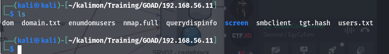<figcaption>
output ADmon
</figcaption></figure>

i discovered files and I found TGT hash that ADmon fails to crack it and users.txt has usernames and querydispinfo has users and descriptions and i got the first password from the description \

<figure>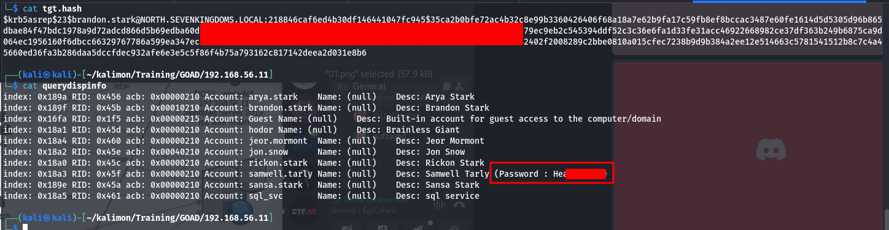<figcaption></figcaption></figure>

so i used that user and password to discover more users using Crackmapexec and started to collect all users I found in one file&#x20;

<figure>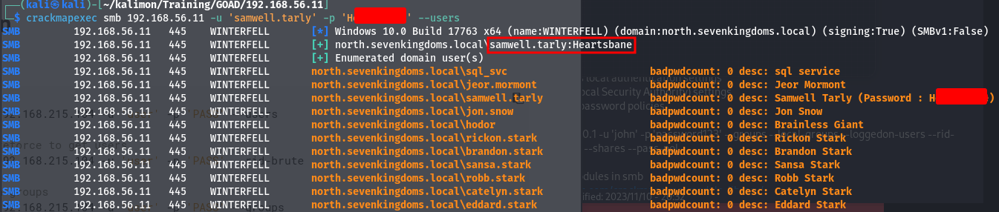<figcaption></figcaption></figure>

i discovered the GOAD writeup and notes he used the GOT series in usernames Enumeration but he used a command to get content and extract names of Crew, but i used other method and you can use a better method in another scenario, so i opened the GOT website and collect all names and used a python script to generate names form these names  (you have to think like system Administrator) if you have user's name Andrew Adam you can create username account in diff. ways such as A.Adam, Andrew.Adam, AndrewA, AAdam, Andrew.A and many of usernames \
so i used namemash.py script from Jeo Helle to generate usernames&#x20;



after that, i had many usernames (980), so I started to validate which machine had which user from my list based on port 88 using nmap script engine&#x20;

<figure>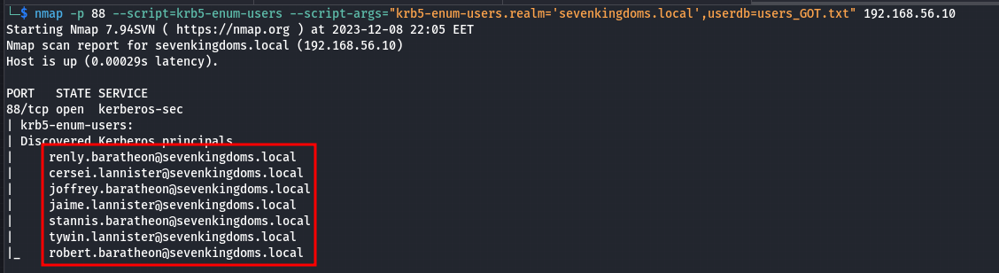<figcaption>
192.168.56.10
</figcaption></figure>

<figure><figcaption>
192.168.56.12
</figcaption></figure>

i collect every machine's users in a file and start to do ASREP-ROASTING on all machine&#x20;

i didn't find any NPusers in machines 10-12 but i found in 11 and I had TGT hash for one of users

<figure>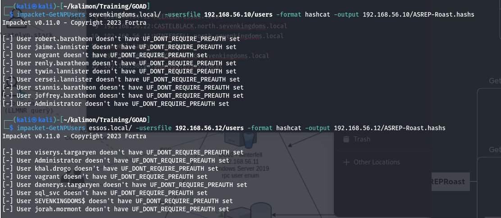<figcaption></figcaption></figure>

<figure>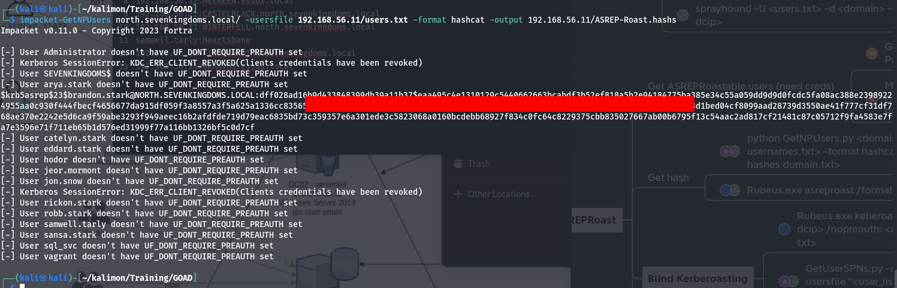<figcaption></figcaption></figure>

this is TGT hash i found before using ADmon and Now I have to crack it \
i used Hashcat&#x20;

<figure>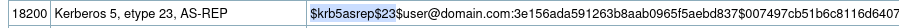<figcaption>
TGT hash type
</figcaption></figure>

finally, it cracked

<figure>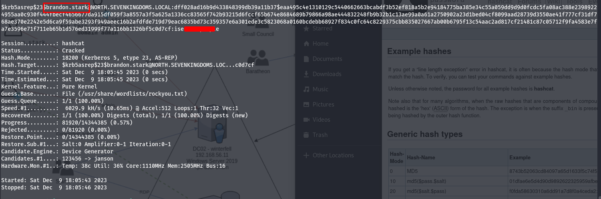<figcaption>
cracked TGT hash
</figcaption></figure>

now i have 2 users with 2 passwords, let's do some password spraining but we have to check on the password policy&#x20;

<figure>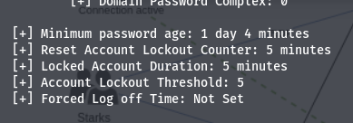<figcaption>
Enum4linux
</figcaption></figure>

<figure>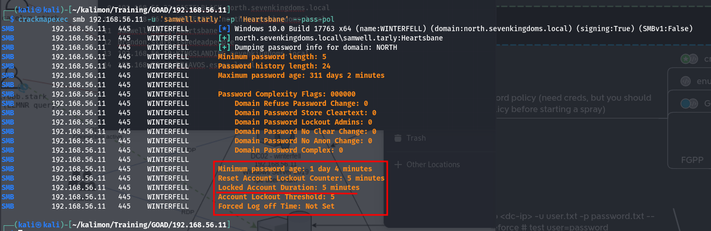<figcaption>
CME
</figcaption></figure>

so user accounts will lockout if we enter 5 wrong passwords in less than 5 minutes, we have to be careful&#x20;

a using crackmapexec with a username list and in the password field i added the same username list&#x20;

<figure>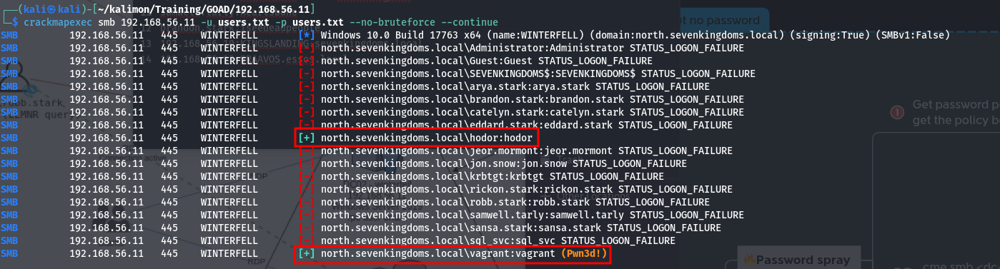<figcaption></figcaption></figure>

Great, Now I have 4 users with passwords&#x20;

now we finished black box user Recon. Remember you can do it better, let's do enumeration with valid credentials and get initial Access With Part 2 ([Reconnaissance 0x02](reconnaissance-0x02.md))

**Thanks for Reading**&#x20;

